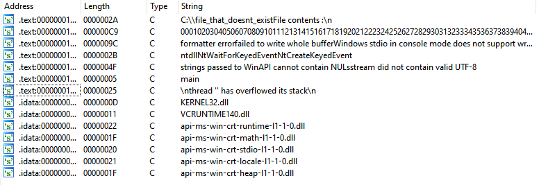
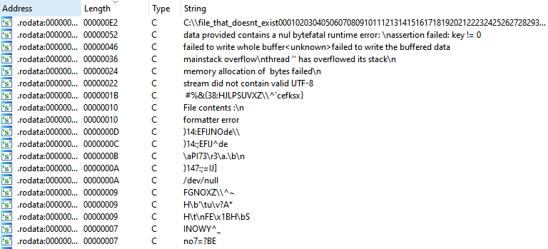

This is a test project to try to generate the smallest `std` binary.

## Prerequisites
```bash
# Nightly toolchain to allow -Zbuild-std
rustup install nightly
# Rust source to recompile it with the correct profile
rustup +nightly component add rust-src
```

## Build
In order to build, simply use cargo with the nightly toolchain :
```bash
# Release
# The --target argument MUST be provided when building std
# panic_immediate_abort disables any error message printing on panic. This removes all unused strings and filepaths.
cargo +nightly -Zbuild-std-features=panic_immediate_abort build --release --target x86_64-unknown-linux-gnu

# Debug with nice messages and unwind
cargo +nightly build --target x86_64-unknown-linux-gnu
```

## Results
On both Windows\Linux, you can see that all debug strings have been removed only leaving strings that are used in your source or required strings like imported module names or some std errors.

### Windows
Binary size : 32,768 bytes

Strings :


### Linux
Binary size : 38,992 bytes

Strings :
